# 가챠트립 (GachaTrip) ER 다이어그램

> 작성일: 2026-09-20 | 기준 소스: Figma 와이어프레임 스펙 (`figma_specs/`)

---

## ERD (Entity-Relationship Diagram)

```mermaid
erDiagram

    USER {
        bigint id PK
        varchar email UK
        varchar password_hash
        varchar nickname UK
        date nickname_changed_at
        varchar profile_image_url
        varchar bio
        varchar auth_provider "LOCAL | KAKAO | GOOGLE | APPLE"
        varchar provider_id
        varchar language "ko | en"
        boolean is_active
        timestamp created_at
        timestamp updated_at
    }

    USER_PREFERENCE {
        bigint id PK
        bigint user_id FK
        varchar departure_region
        int budget_min
        int budget_max
        boolean recommend_alert
        boolean location_based_recommend
        timestamp updated_at
    }

    USER_TRAVEL_STYLE {
        bigint id PK
        bigint user_id FK
        varchar style "HEALING | FOOD | ACTIVITY | MOOD"
    }

    DESTINATION {
        bigint id PK
        varchar name
        varchar region "서울 | 부산 | 제주 | 강원 | ..."
        varchar description
        varchar thumbnail_url
        varchar capsule_image_url
        boolean is_active
        float latitude
        float longitude
        timestamp created_at
        timestamp updated_at
    }

    DESTINATION_TAG {
        bigint id PK
        bigint destination_id FK
        varchar tag "바다여행 | 야경 | 낭만 | 힐링 | ..."
    }

    GACHA_ROOM {
        bigint id PK
        bigint host_user_id FK
        varchar room_code UK "6자리 초대 코드"
        varchar mode "SOLO | GROUP"
        varchar status "WAITING | DRAWING | RESULT | CLOSED"
        varchar step "조건입력 | 대기실 | 뽑기중 | 투표진행 | 결과확인 | 결과저장"
        int max_members
        timestamp created_at
        timestamp closed_at
    }

    GACHA_CONDITION {
        bigint id PK
        bigint room_id FK
        bigint user_id FK
        varchar travel_style
        varchar departure_region
        int budget_min
        int budget_max
        varchar duration "당일치기 | 1박2일 | 2박3일 | 3박4일이상"
        varchar desired_destination "희망 여행지 (선택)"
        timestamp created_at
    }

    GACHA_ROOM_MEMBER {
        bigint id PK
        bigint room_id FK
        bigint user_id FK
        boolean is_host
        varchar status "ONLINE | OFFLINE | SELECTED"
        timestamp joined_at
    }

    GACHA_RESULT {
        bigint id PK
        bigint room_id FK
        bigint destination_id FK
        varchar result_type "SOLO | GROUP"
        boolean is_confirmed
        timestamp drawn_at
        timestamp confirmed_at
    }

    VISITED_DESTINATION {
        bigint id PK
        bigint user_id FK
        bigint destination_id FK
        date visited_date
        timestamp recorded_at
    }

    CURATION_PLAN {
        bigint id PK
        bigint user_id FK
        bigint gacha_result_id FK
        bigint destination_id FK
        varchar title
        date travel_start
        date travel_end
        varchar status "UPCOMING | ONGOING | PAST"
        boolean is_saved
        timestamp ai_generated_at
        timestamp saved_at
    }

    PLACE {
        bigint id PK
        bigint destination_id FK
        varchar name
        varchar category "RESTAURANT | CAFE | ATTRACTION | ACTIVITY"
        varchar address
        varchar description
        varchar image_url
        float latitude
        float longitude
    }

    DAILY_COURSE {
        bigint id PK
        bigint curation_plan_id FK
        int day_number
        varchar memo
    }

    DAILY_COURSE_PLACE {
        bigint id PK
        bigint daily_course_id FK
        bigint place_id FK
        int order_index
        varchar tip "가기 전 팁"
    }

    TRAVEL_RECORD {
        bigint id PK
        bigint user_id FK
        bigint destination_id FK
        bigint curation_plan_id FK "nullable"
        date travel_date
        varchar memo
        varchar photo_url "nullable"
        timestamp created_at
        timestamp updated_at
    }

    BADGE {
        bigint id PK
        varchar name
        varchar description
        varchar image_url
        varchar region
        varchar unlock_condition "방문 횟수, 특정 지역 등"
    }

    USER_BADGE {
        bigint id PK
        bigint user_id FK
        bigint badge_id FK
        timestamp acquired_at
    }

    MISSION {
        bigint id PK
        bigint gacha_result_id FK
        bigint user_id FK
        varchar content "AI 생성 미션 텍스트"
        boolean is_completed
        timestamp generated_at
        timestamp completed_at
    }

    GROUP_VOTE {
        bigint id PK
        bigint room_id FK
        bigint destination_id FK
        bigint voter_user_id FK
        boolean is_agreed
        timestamp voted_at
    }

    NOTIFICATION {
        bigint id PK
        bigint user_id FK
        varchar type "GACHA_DONE | GROUP_INVITE | CURATION_READY | DDAY_REMIND"
        varchar title
        varchar body
        boolean is_read
        timestamp created_at
        timestamp read_at
    }

    REPORT {
        bigint id PK
        bigint reporter_user_id FK
        bigint target_user_id FK
        varchar reason
        varchar status "PENDING | RESOLVED | DISMISSED"
        timestamp created_at
        timestamp resolved_at
    }

    INQUIRY {
        bigint id PK
        bigint user_id FK
        varchar title
        varchar content
        varchar answer "nullable"
        bigint answered_by FK "admin user id"
        varchar status "PENDING | ANSWERED"
        timestamp created_at
        timestamp answered_at
    }

    NOTICE {
        bigint id PK
        bigint admin_user_id FK
        varchar title
        varchar content
        boolean is_published
        timestamp created_at
        timestamp updated_at
    }

    GACHA_POLICY {
        bigint id PK
        float weight_user_preference "사용자 취향"
        float weight_distance "출발지 거리"
        float weight_weather "현재 날씨"
        float weight_budget "예산 적합도"
        float weight_discovery "새로운 발견"
        boolean rule_exclude_recent_30days
        boolean rule_exclude_inactive
        boolean rule_penalize_bad_weather
        boolean rule_limit_same_region
        boolean rule_correct_metro_bias
        varchar version "v1.8.3"
        varchar deploy_status "LIVE | DRAFT | ARCHIVED"
        bigint deployed_by FK
        timestamp deployed_at
        timestamp created_at
    }

    %% ─── Relations ───

    USER ||--o{ USER_PREFERENCE : "has"
    USER ||--o{ USER_TRAVEL_STYLE : "has"
    USER ||--o{ GACHA_ROOM : "hosts"
    USER ||--o{ GACHA_ROOM_MEMBER : "participates"
    USER ||--o{ GACHA_CONDITION : "sets"
    USER ||--o{ VISITED_DESTINATION : "visits"
    USER ||--o{ CURATION_PLAN : "owns"
    USER ||--o{ TRAVEL_RECORD : "writes"
    USER ||--o{ USER_BADGE : "earns"
    USER ||--o{ MISSION : "receives"
    USER ||--o{ NOTIFICATION : "receives"
    USER ||--o{ REPORT : "reports"
    USER ||--o{ INQUIRY : "submits"

    DESTINATION ||--o{ DESTINATION_TAG : "tagged"
    DESTINATION ||--o{ GACHA_RESULT : "drawn as"
    DESTINATION ||--o{ VISITED_DESTINATION : "visited by"
    DESTINATION ||--o{ CURATION_PLAN : "planned for"
    DESTINATION ||--o{ PLACE : "has"
    DESTINATION ||--o{ BADGE : "unlocks"
    DESTINATION ||--o{ TRAVEL_RECORD : "recorded in"

    GACHA_ROOM ||--o{ GACHA_ROOM_MEMBER : "has members"
    GACHA_ROOM ||--o{ GACHA_CONDITION : "has conditions"
    GACHA_ROOM ||--o{ GACHA_RESULT : "produces"
    GACHA_ROOM ||--o{ GROUP_VOTE : "has votes"

    GACHA_RESULT ||--o{ CURATION_PLAN : "generates"
    GACHA_RESULT ||--o{ MISSION : "generates"

    CURATION_PLAN ||--o{ DAILY_COURSE : "has"
    DAILY_COURSE ||--o{ DAILY_COURSE_PLACE : "has"
    PLACE ||--o{ DAILY_COURSE_PLACE : "included in"

    BADGE ||--o{ USER_BADGE : "awarded to"
```

---

## 엔티티 상세 설명

---

### USER (회원)
| 속성 | 타입 | 설명 |
|---|---|---|
| `id` | bigint PK | 자동 증가 기본키 |
| `email` | varchar UK | 로그인 이메일 (소셜 로그인도 이메일 저장) |
| `password_hash` | varchar | bcrypt 해시 (소셜 로그인은 NULL) |
| `nickname` | varchar UK | 2~10자, 공개 표시명 |
| `nickname_changed_at` | date | 닉네임 변경일 (30일 이내 재변경 불가) |
| `auth_provider` | enum | `LOCAL / KAKAO / GOOGLE / APPLE` |
| `provider_id` | varchar | 소셜 플랫폼에서 발급한 고유 ID |

---

### USER_PREFERENCE (회원 여행 설정)
| 속성 | 설명 |
|---|---|
| `departure_region` | 자주 출발하는 지역 (서울/경기, 강원, 제주 등) |
| `budget_min / max` | 여행 예산 범위 (원 단위) |
| `recommend_alert` | 추천 알림 ON/OFF |
| `location_based_recommend` | 위치 기반 추천 동의 여부 |

---

### USER_TRAVEL_STYLE (회원 여행 스타일, 최대 2개)
- `HEALING` / `FOOD` / `ACTIVITY` / `MOOD` (감성)
- 별도 테이블로 분리 (최대 2행)

---

### DESTINATION (여행지)
| 속성 | 설명 |
|---|---|
| `region` | 시·도 단위 지역 구분 |
| `capsule_image_url` | 지역별 가챠 캡슐 볼 이미지 |
| `is_active` | 비활성 여행지는 뽑기 후보에서 제외 |

---

### GACHA_ROOM (뽑기 방)
| 속성 | 설명 |
|---|---|
| `mode` | `SOLO` (개인) / `GROUP` (그룹) |
| `room_code` | 그룹 모드 전용 6자리 초대 코드 |
| `step` | 그룹방 진행 단계 (대기실 → 뽑기중 → 투표 → 결과) |
| `status` | 전체 방 상태 (관리자 모니터링용) |

---

### GACHA_CONDITION (뽑기 조건)
- 개인/그룹 모두 동일 엔티티 사용 (`user_id`로 개인 조건 구분)
- 그룹 모드에서는 방 멤버별로 각자 한 행씩 저장

---

### GACHA_RESULT (뽑기 결과)
| 속성 | 설명 |
|---|---|
| `is_confirmed` | 확정 여부 ("이 여행지로 확정하기" 완료 시 true) |
| `drawn_at` | 뽑힌 시각 |
| `confirmed_at` | 확정 완료 시각 |

---

### CURATION_PLAN (AI 큐레이션 여행 계획)
| 속성 | 설명 |
|---|---|
| `status` | `UPCOMING` (예정) / `ONGOING` (진행중) / `PAST` (지난 여행) |
| `is_saved` | 마이트립에 저장 여부 |
| `ai_generated_at` | AI 코스 생성 완료 시각 |

---

### DAILY_COURSE / DAILY_COURSE_PLACE (일정 코스)
- `DAILY_COURSE`: Day 1 / Day 2 ... 단위 일정
- `DAILY_COURSE_PLACE`: 해당 일정에 포함된 장소 순서 리스트
- `tip`: 해당 장소의 "가기 전 팁" 텍스트

---

### BADGE (배지/키링)
- 특정 지역 방문 시 자동 획득
- `unlock_condition`: 조건 텍스트 (예: "제주도 첫 방문", "3회 뽑기" 등)

---

### MISSION (AI 랜덤 미션)
- 뽑기 결과 확정 후 AI가 생성하는 여행 미션
- 그룹 뽑기 결과에 연결 가능

---

### GROUP_VOTE (그룹 투표)
- 그룹 모드에서 최종 여행지 투표
- `is_agreed`: 동의/반대

---

### GACHA_POLICY (가챠 정책)
| 속성 | 설명 |
|---|---|
| `weight_*` | 추천 가중치 5종 (합계 = 1.0 기준) |
| `rule_*` | 제외·보정 규칙 5종 ON/OFF |
| `deploy_status` | `LIVE` / `DRAFT` / `ARCHIVED` |
| `version` | 배포 버전 문자열 (예: v1.8.3) |

---

## 주요 관계 요약

| 관계 | 설명 |
|---|---|
| USER → GACHA_ROOM | 1명의 유저가 여러 방을 개설 가능 |
| GACHA_ROOM → GACHA_ROOM_MEMBER | 1개 방에 여러 멤버 |
| GACHA_ROOM → GACHA_CONDITION | 방별 (또는 개인별) 뽑기 조건 |
| GACHA_ROOM → GACHA_RESULT | 방에서 뽑기 결과가 생성됨 |
| GACHA_RESULT → CURATION_PLAN | 확정된 결과에서 AI 큐레이션 생성 |
| CURATION_PLAN → DAILY_COURSE → DAILY_COURSE_PLACE | 일정 계층 구조 |
| DESTINATION → BADGE | 지역 방문 시 배지 획득 조건 연결 |
| USER → VISITED_DESTINATION | 방문 기록 (지도 색상 표시용) |
| USER → TRAVEL_RECORD | 여행 기록 (마이트립 목록용) |

---

## Enum 정의 요약

| Enum | 값 |
|---|---|
| `auth_provider` | `LOCAL`, `KAKAO`, `GOOGLE`, `APPLE` |
| `travel_style` | `HEALING`, `FOOD`, `ACTIVITY`, `MOOD` |
| `gacha_mode` | `SOLO`, `GROUP` |
| `room_status` | `WAITING`, `DRAWING`, `RESULT`, `CLOSED` |
| `room_step` | `조건입력`, `대기실`, `뽑기중`, `투표진행`, `결과확인`, `결과저장` |
| `trip_duration` | `당일치기`, `1박2일`, `2박3일`, `3박4일이상` |
| `curation_status` | `UPCOMING`, `ONGOING`, `PAST` |
| `notification_type` | `GACHA_DONE`, `GROUP_INVITE`, `CURATION_READY`, `DDAY_REMIND` |
| `place_category` | `RESTAURANT`, `CAFE`, `ATTRACTION`, `ACTIVITY` |
| `inquiry_status` | `PENDING`, `ANSWERED` |
| `report_status` | `PENDING`, `RESOLVED`, `DISMISSED` |
| `deploy_status` | `LIVE`, `DRAFT`, `ARCHIVED` |
