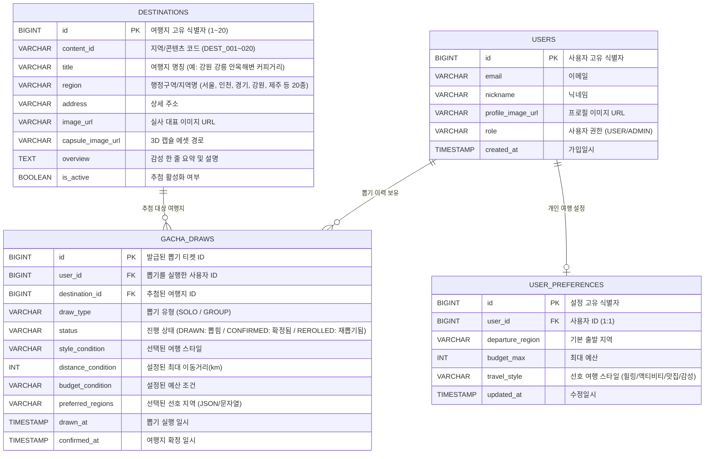

# 🎲 가챠트립 (GachaTrip) 실전 ER 다이어그램 (혼자 뽑기 & 20개 지역 중심)

> 본 문서는 현재 실제 프론트엔드-백엔드 간 REST API로 연동되어 동작하는 **핵심 엔티티(사용자, 20대 지역 여행지, 가챠 뽑기 및 확정 이력)** 중심의 실전형 ER 다이어그램입니다.  
> *(참고: 전체 20개 확장 엔티티는 `02_ER다이어그램.md`에 보관되어 있습니다.)*

---

## 1. 핵심 ER 다이어그램 (Mermaid)

---

## 2. 테이블 상세 명세

### 2.1 `destinations` (전국 20대 대표 지역 여행지)
| 컬럼명 | 타입 | Nullable | 기본값 | 설명 |
| :--- | :--- | :---: | :---: | :--- |
| **id** | `BIGINT` | PK | Auto Inc | 여행지 고유 ID (1 ~ 20) |
| **content_id** | `VARCHAR(50)` | NOT NULL | - | 고유 식별 코드 (`DEST_001` ~ `DEST_020`) |
| **title** | `VARCHAR(100)` | NOT NULL | - | 여행지명 (예: `제주 협재 에메랄드 바다 & 금능 피크닉`) |
| **region** | `VARCHAR(50)` | NOT NULL | - | 행정구역 (20개: 서울, 인천, 경기, 강원, 충북, 충남, 대전, 세종, 전북, 전남, 광주, 경북, 경남, 대구, 울산, 부산, 제주, 울릉도, 독도, 백령도) |
| **address** | `VARCHAR(255)` | NULL | - | 상세 도로명 주소 |
| **image_url** | `VARCHAR(500)` | NULL | - | 관광지 실사 사진 URL |
| **capsule_image_url** | `VARCHAR(500)` | NULL | - | 지역별 3D 캡슐 그래픽 경로 |
| **overview** | `TEXT` | NULL | - | 감성 큐레이션 요약 문구 |
| **is_active** | `BOOLEAN` | NOT NULL | `TRUE` | 가챠 추첨 후보 포함 여부 |

### 2.2 `gacha_draws` (가챠 뽑기 티켓 및 확정 이력)
| 컬럼명 | 타입 | Nullable | 기본값 | 설명 |
| :--- | :--- | :---: | :---: | :--- |
| **id** | `BIGINT` | PK | Auto Inc | 티켓 고유 번호 |
| **user_id** | `BIGINT` | NOT NULL | FK | 뽑기 실행 유저 (`users.id`) |
| **destination_id** | `BIGINT` | NOT NULL | FK | 추첨된 여행지 (`destinations.id`) |
| **draw_type** | `VARCHAR(20)` | NOT NULL | `'SOLO'` | `'SOLO'` (혼자 뽑기) / `'GROUP'` (그룹 뽑기) |
| **status** | `VARCHAR(20)` | NOT NULL | `'DRAWN'` | `'DRAWN'`(뽑힘), `'CONFIRMED'`(확정됨) |
| **style_condition** | `VARCHAR(50)` | NULL | - | 선택한 스타일 (`healing`, `activity`, `food`, `vibe`) |
| **distance_condition** | `INT` | NULL | `150` | 이동 거리 필터 (km) |
| **budget_condition** | `VARCHAR(50)` | NULL | - | 예산 필터 (예: `10만원 이하`) |
| **drawn_at** | `TIMESTAMP` | NOT NULL | `NOW()` | 추첨 일시 |
| **confirmed_at** | `TIMESTAMP` | NULL | - | 최종 여행지 확정 일시 |

---

## 3. 전국 20개 지역 데이터 매핑 규격 (1~20번)

| ID | 지역(Region) | 대표 여행지 명칭 (`title`) | 3D 캡슐 에셋 | 확정 카드 에셋 |
| :---: | :--- | :--- | :--- | :--- |
| **1** | **서울** | 서울 경복궁 & 북촌 한옥마을 | `1. 서울.png` | `1. 서울.png` |
| **2** | **인천** | 인천 강화도 노을 산책 (동막해변) | `2. 인천.png` | `2. 인천.png` |
| **3** | **경기** | 경기 파주 헤이리 예술마을 & 출판단지 | `3. 경기.png` | `3. 경기.png` |
| **4** | **강원** | 강원 강릉 안목해변 커피거리 | `4. 강원.png` | `4. 강원.png` |
| **5** | **충북** | 충북 단양 도담삼봉 & 만천하스카이워크 | `5. 충북.png` | `5. 충북.png` |
| **6** | **충남** | 충남 태안 꽃지해수욕장 & 붉은 노을 | `6. 충남.png` | `6. 충남.png` |
| **7** | **대전** | 대전 엑스포 한빛탑 & 한밭수목원 | `7. 대전.png` | `7. 대전.png` |
| **8** | **세종** | 세종 국립세종수목원 & 금강보행교 | `8. 세종.png` | `8. 세종.png` |
| **9** | **전북** | 전북 전주 한옥마을 & 경기전 | `9. 전북.png` | `9. 전북.png` |
| **10** | **전남** | 전남 여수 오동도 & 해상 케이블카 | `10. 전남.png` | `10. 전남.png` |
| **11** | **광주** | 광주 국립아시아문화전당 & 펭귄마을 | `11. 광주.png` | `11. 광주.png` |
| **12** | **경북** | 경북 경주 황리단길 & 첨성대 야경 | `12. 경북.png` | `12. 경북.png` |
| **13** | **경남** | 경남 통영 동피랑 벽화마을 & 디피랑 | `13. 경남.png` | `13. 경남.png` |
| **14** | **대구** | 대구 김광석 다시그리기길 & 근대골목 | `14. 대구.png` | `14. 대구.png` |
| **15** | **울산** | 울산 대왕암공원 & 해상 출렁다리 | `15. 울산.png` | `15. 울산.png` |
| **16** | **부산** | 부산 광안리 드론쇼 & 해변 산책 | `16. 부산.png` | `16. 부산.png` |
| **17** | **제주** | 제주 협재 에메랄드 바다 & 금능 피크닉 | `17. 제주.png` | `17. 제주.png` |
| **18** | **울릉도** | 울릉도 행남 해안산책로 & 독도전망대 | `18. 울릉도.png` | `18. 울릉도.png` |
| **19** | **독도** | 독도 몽돌해변 & 천연기념물 탐방 | `19. 독도.png` | `19. 독도.png` |
| **20** | **백령도** | 백령도 두무진 해식절벽 유람선 투어 | `20. 백령도.png` | `20. 백령도.png` |
